# Tokyo Olympic Data Analytics | End-to-End Azure Data Engineering Project

## Overview

In this project, I developed an end-to-end data engineering pipeline to analyze data from the Tokyo Olympics. Leveraging various Azure tools, I efficiently ingested, stored, transformed, and analyzed large datasets, ultimately providing valuable insights into Olympic performance.

## Architecture

The architecture for this project involves several key components, each playing a crucial role in the end-to-end data engineering process:

### Data Source
- **Source**: Kaggle
- **Description**: Raw datasets related to the Tokyo Olympics, including comprehensive information on athletes, coaches, events, and results.

### Data Ingestion
- **Tool Used**: Azure Data Factory (ADF)
- **Role**: Orchestrates the ETL (Extract, Transform, Load) process by connecting to various data sources and ingesting data into cloud-based storage.

### Raw Data Storage
- **Tool Used**: Azure Data Lake Storage Gen2 (ADLS Gen2)
- **Role**: Provides scalable and secure storage for raw data, ensuring efficient storage and access for large volumes of data.

### Data Transformation
- **Tool Used**: Azure Databricks
- **Role**: Facilitates data processing and transformation using Apache Spark. This includes data cleaning, transformation, and preparation for structured analysis.


### Transformed Data Storage
- **Tool Used**: Azure Data Lake Storage Gen2 (ADLS Gen2)
- **Role**: Stores transformed data, making it readily available for efficient querying and analysis.

### Data Analytics
- **Tool Used**: Azure Synapse Analytics
- **Role**: Provides a unified experience for big data and data warehousing, enabling advanced querying and analysis of transformed data.

## Workflow
First I created the following resource group:

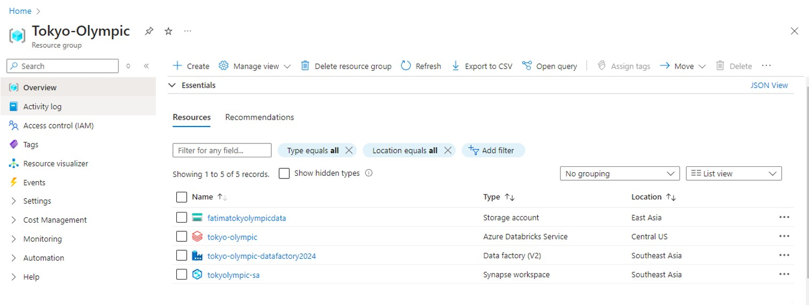

### 1. Ingest Data
I started by ingesting data from source into Azure Data Lake Storage Gen2 using Azure Data Factory. I used ADF to orchestrate the ETL (Extract, Transform, Load) process. ADF connected to the data sources and ingested the data into a cloud-based storage solution, automating the data extraction and loading processes, ensuring a smooth and efficient data ingestion workflow.

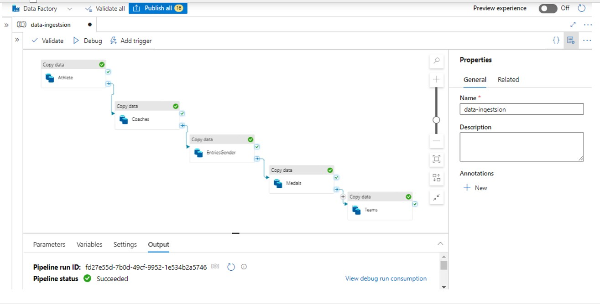

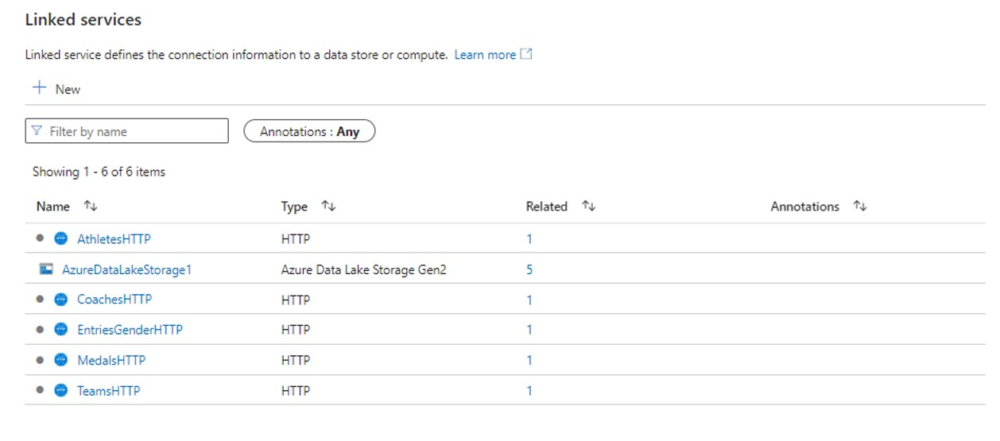

### 2. Store Raw Data
Once the data was ingested, I securely stored it in Azure Data Lake Storage Gen2. This provided a reliable and scalable repository for my raw data, which I could access whenever needed for processing.
 
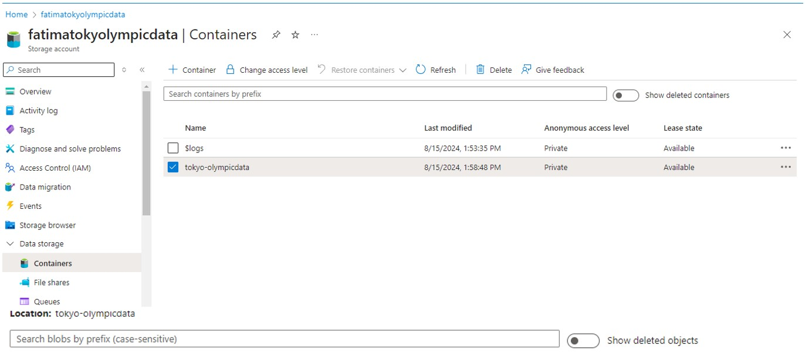

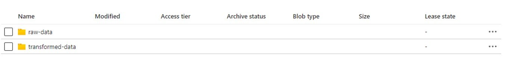

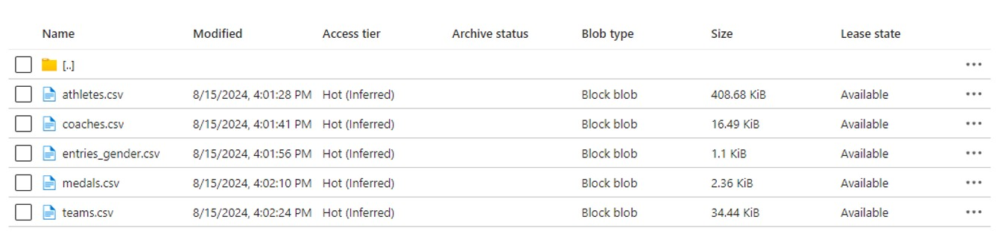

### 3. Transform Data
I then used Azure Databricks to transform the raw data. By leveraging Apache Spark, I cleaned the data, corrected data types, and structured it for analysis. To ensure secure access to the data stored in Azure Data Lake, I connected through a SAS token.

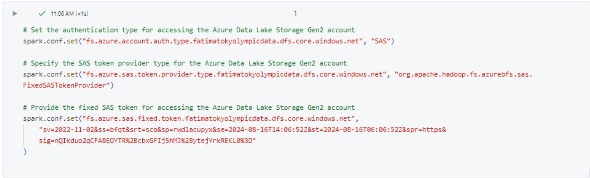

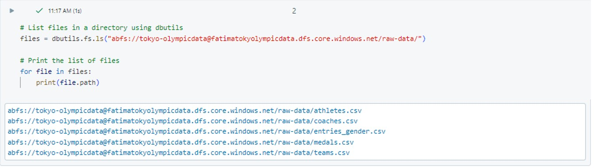

### 4. Store Transformed Data
After transformation, I saved the cleaned and organized data back into Azure Data Lake Storage Gen2. This step ensured that the data was structured and readily available for the next phase of analysis.

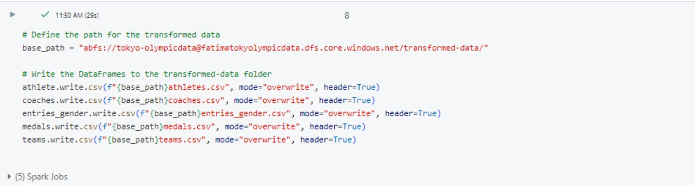

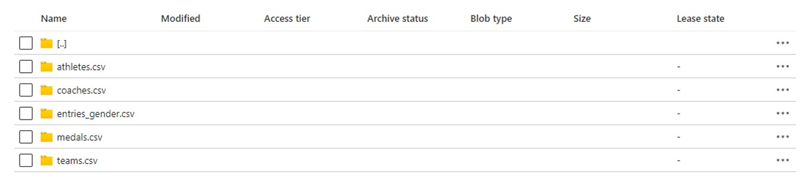

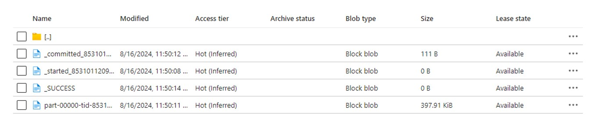

### 5. Analyze Data
Finally, I used Azure Synapse Analytics to analyze the transformed data. I wrote and executed SQL queries to explore the data and extract meaningful insights, such as:
  - Total number of athletes for each country
  - Top countries that won gold medals
  - Average number of entries by gender for each discipline

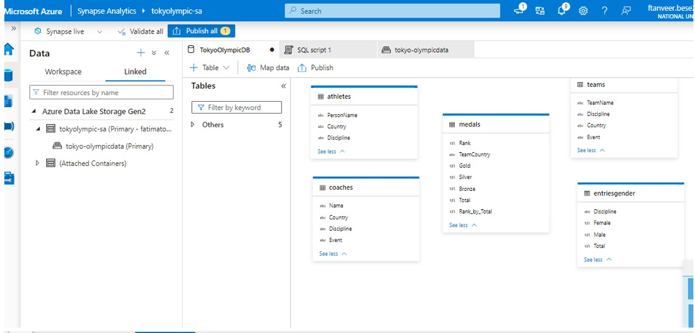

### 5. Results

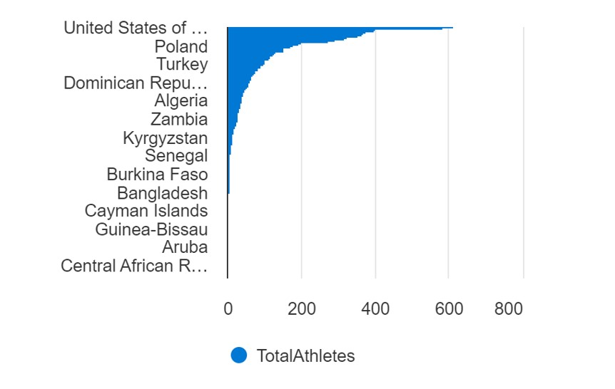

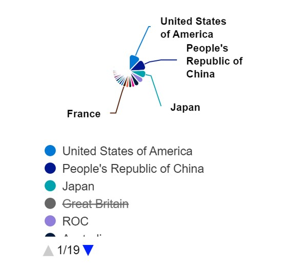

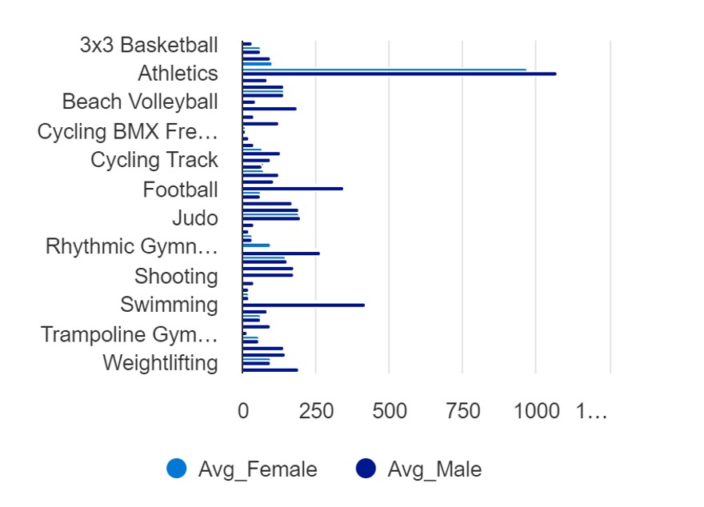

## Conclusion

In this project, I successfully used various Microsoft Azure tools to manage and analyze Olympic data. By employing Azure Data Factory for data ingestion, Azure Data Lake Storage Gen2 for storage, Azure Databricks for transformation, and Azure Synapse Analytics for analysis, I delivered valuable insights into the Tokyo Olympics. The pipeline exemplifies a robust and scalable approach to handling large datasets and generating actionable analytics.

## How to Run This Project

### Prerequisites
- **Azure Subscription**: Required to set up the necessary Azure services.
- **Kaggle API**: To download the raw datasets from Kaggle.
- **Azure Data Factory**: For orchestrating the ETL process.
- **Azure Databricks**: For data transformation.
- **Azure Synapse Analytics**: For data analysis.

### Setup Instructions
1. **Clone the Repository**: 
   ```bash
   git clone https://github.com/yourusername/Tokyo-Olympic-Data-Analytics.git
   ```
2. **Data Ingestion**:
   - Set up Azure Data Factory.
   - Use the provided pipeline to ingest data from Kaggle into Azure Data Lake Storage Gen2.

3. **Data Transformation**:
   - Set up an Azure Databricks workspace.
   - Use the provided notebooks to transform the raw data.

4. **Data Analysis**:
   - Set up Azure Synapse Analytics.
   - Use the provided SQL scripts to query the transformed data and generate insights.
   
---
